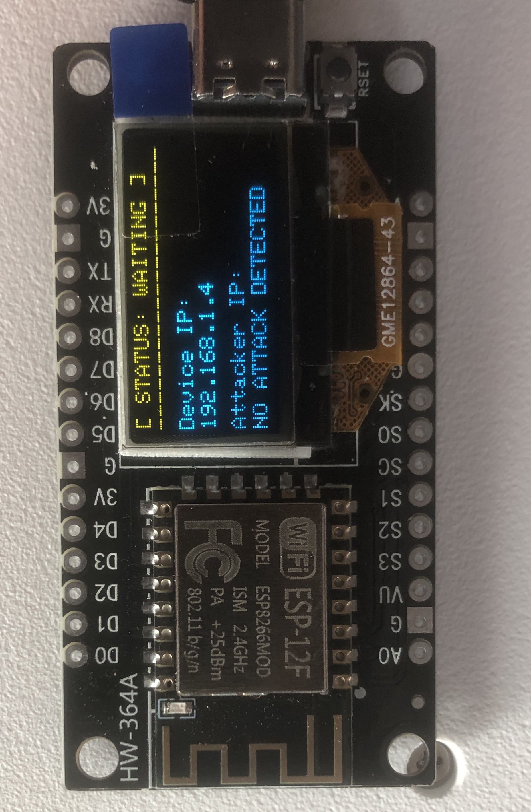

# IoT-Honeypot
An ESP8266-based IoT Honeypot to detect and log unauthorized access attempts.

# 🛡️ IoT-Honeypot Using ESP8266 with Telegram Alerts & OLED Display

An open-source, lightweight **IoT Honeypot** built on the **ESP8266** platform. This project is designed to detect and log unauthorized network scans and intrusion attempts on a local network. 

It emulates a vulnerable **Smart-Cam Linux Node on Telnet (Port 23)**. When a hacker or automated scanner attempts to connect, the device captures their IP address, triggers an **Angry Robot Eyes Alert** on an I2C OLED display, and immediately sends a secure **HTTPS alert notification to your Telegram Channel/Bot**.

---

## ✨ Features
*   **Telnet Service Emulation:** Mimics an insecure Smart Camera Linux Node login prompt on Port 23.
*   **Visual Intrusion Alerts:** Displays a custom graphical "Angry Robot Eyes" warning screen on a 128x64 SSD1306 OLED display upon intrusion.
*   **Instant Telegram Notifications:** Uses secure HTTPS (`WiFiClientSecure`) to push live attacker IP tracking directly to your phone.
*   **Built-in Status LED Indicator:** Blinks during Wi-Fi setup and lights up steadily when an attack is caught.
*   **Automatic Reset:** Automatically purges the malicious connection after logging and goes back to standard stealth monitoring mode after 5 seconds.

---

## 🛠️ Hardware Component Requirements
*   **Microcontroller:** ESP8266 (NodeMCU V2/V3 or WeMos D1 Mini).
*   **Display:** 0.96" SSD1306 I2C OLED Display (128x64 resolution).
*   **Indicators:** On-board Built-in LED.
*   **Wiring/Pins Used:**
    *   `SDA` Pin -> **GPIO 14** (D5 on NodeMCU)
    *   `SCL` Pin -> **GPIO 12** (D6 on NodeMCU)

---

## 💻 Software & Libraries Required
Ensure you have the following libraries installed in your **Arduino IDE**:
1.  `Adafruit_SSD1306` (by Adafruit)
2.  `Adafruit_GFX_Library` (by Adafruit)
3.  `ESP8266WiFi` (Built-in with ESP8266 Core)

---

## 🔧 Installation & Deployment Setup

1.  **Clone the Repository:**
    ```bash
    git clone https://github.com
    ```
2.  **Configure Credentials:** Open the `.ino` file and update the configuration tokens securely:
    ```cpp
    const char* WIFI_SSID = "YOUR_WIFI_SSID";
    const char* WIFI_PASS = "YOUR_WIFI_PASSWORD";
    const char* BOT_TOKEN = "YOUR_TELEGRAM_BOT_TOKEN"; 
    const char* CHAT_ID   = "YOUR_TELEGRAM_CHAT_ID";
    ```
3.  **Board Configurations:**
    *   Go to *Tools > Board* and choose **NodeMCU 1.0 (ESP-12E Module)**.
    *   Select your active port and press **Upload**.

---

## 📊 Live Demonstration & Workflow
1.  **Boot Phase:** The OLED prints `Honeypot Booting...` while the LED flashes dynamically during network initialization.
2.  **Stealth Listening:** Once online, the screen shows `[ STATUS: WAITING ]` along with the assigned Local Device IP address.
   

4.  **Triggering an Attack:** An attacker attempts a port sweep or direct connection via terminal:
    ```bash
    telnet <YOUR_ESP8266_IP> 23
    ```
5.  **The Trap:** The attacker receives a spoofed dummy banner: `Welcome to Smart-Cam Linux Node v4.19`.
6.  **The Response:** The hardware triggers the local LED, draws hostile robot eyes to warn physical onlookers, logs the network parameters to the Serial Monitor (115200 baud), and alerts the administrator via Telegram.

---

## ⚠️ Defensive Disclaimer
This project is developed strictly for **educational and defensive home network monitoring purposes**. Hosting honeypots inside restricted corporate or enterprise environments without explicit administrative authorization is strictly discouraged.
